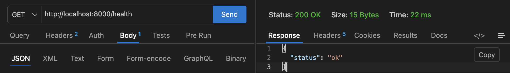
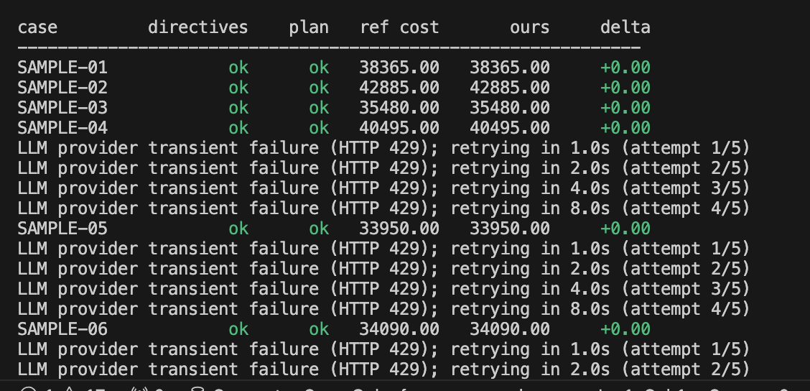
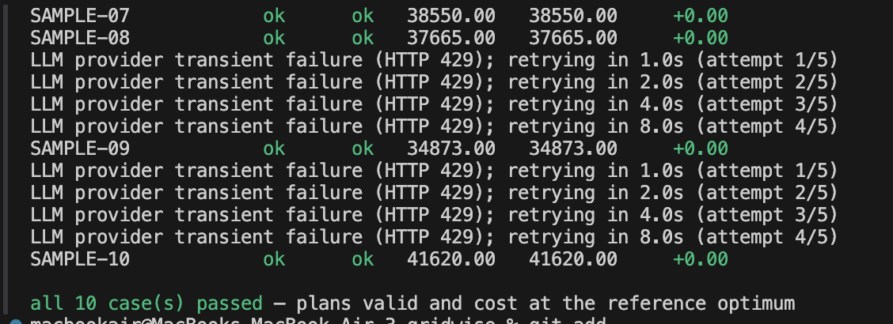
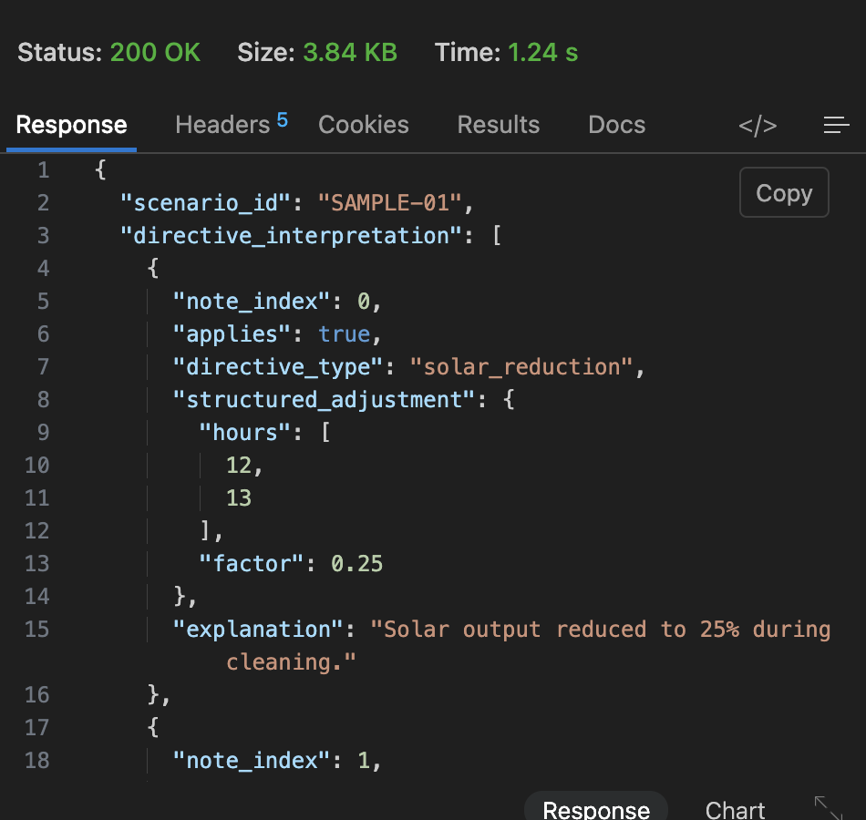
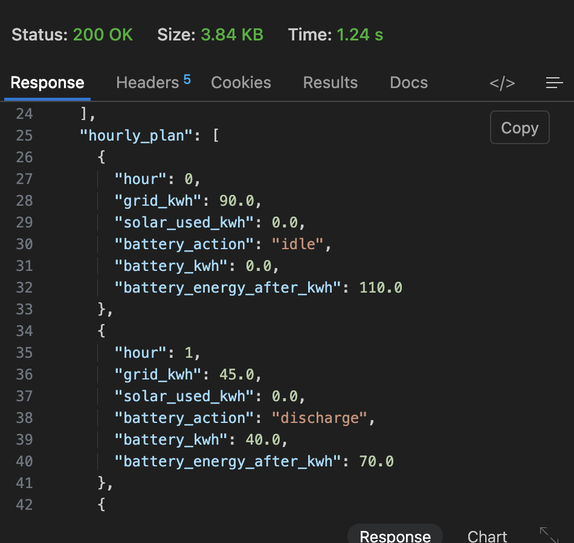
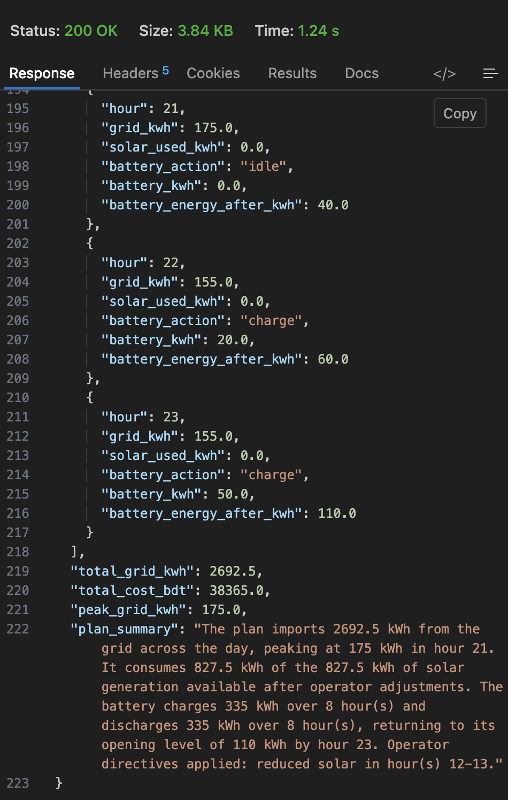

# Gridwise — Smart Campus Energy Optimizer

An HTTP API that takes a 24-hour campus energy scenario plus free-text operator
notes, interprets the notes with an LLM, validates the resulting directives
deterministically, and solves for the cheapest legal 24-hour schedule with
linear programming.

The division of labour is the point of the design:

- **The LLM only reads language.** It converts operator notes into structured
  directives from a closed vocabulary. It never decides when to charge, when to
  import, or what anything should cost.
- **The optimizer makes every energy decision.** A mixed-integer linear program
  minimises grid cost subject to the scenario's physics and the directives.
- **Nothing in between is trusted.** A deterministic guardrail layer validates
  the model's output before it reaches the solver, and an independent validator
  re-checks the finished schedule before it reaches the client.

---

## System Workflow

graph TD
    A[📩 Incoming HTTP Request] -->|POST /optimize-energy| B[1. FastAPI Route]
    B -->|Validate JSON Request| C{2. Pydantic Input Validation}

    C -->|Invalid Scenario| X[❌ 422 Validation Error]
    C -->|Valid Scenario| D[3. LLM Operator-Note Interpreter]

    D -->|Provider unavailable| Y[⚠️ 503 Provider Error]
    D -->|Interpret Notes| E[4. Deterministic Guardrails]

    E -->|Invalid Directives| R[5. One Repair Round]
    R --> E

    E -->|Still Invalid| Z[❌ 502 Interpretation Error]
    E -->|Valid Directives| F[6. Directive Compiler]

    F -->|Merge Overlapping Constraints| G[7. PuLP / CBC MILP Optimizer]

    G -->|No Feasible Schedule| N[❌ 422 Infeasible Scenario]
    G -->|Solver Failure| O[❌ 500 Solver Error]
    G -->|Optimal Schedule| H[8. Independent Schedule Validator]

    H -->|Constraint Violation| P[❌ 500 Validation Error]
    H -->|Valid Schedule| I[9. Round & Re-validate Published Values]

    I -->|Valid Published Plan| J[📤 200 OK Structured JSON Response]

    style A fill:#004d40,stroke:#00bfa5,stroke-width:3px,color:#ffffff
    style B fill:#0d47a1,stroke:#29b6f6,stroke-width:2px,color:#ffffff
    style C fill:#4a148c,stroke:#ab47bc,stroke-width:2px,color:#ffffff
    style D fill:#1565c0,stroke:#42a5f5,stroke-width:2px,color:#ffffff
    style E fill:#e65100,stroke:#ffb74d,stroke-width:2px,color:#ffffff
    style R fill:#ef6c00,stroke:#ffb74d,stroke-width:2px,color:#ffffff
    style F fill:#6a1b9a,stroke:#ba68c8,stroke-width:2px,color:#ffffff
    style G fill:#283593,stroke:#7986cb,stroke-width:2px,color:#ffffff
    style H fill:#00695c,stroke:#4db6ac,stroke-width:2px,color:#ffffff
    style I fill:#2e7d32,stroke:#81c784,stroke-width:2px,color:#ffffff
    style J fill:#1b5e20,stroke:#66bb6a,stroke-width:3px,color:#ffffff

    style X fill:#b71c1c,stroke:#ef5350,stroke-width:2px,color:#ffffff
    style Y fill:#b71c1c,stroke:#ef5350,stroke-width:2px,color:#ffffff
    style Z fill:#b71c1c,stroke:#ef5350,stroke-width:2px,color:#ffffff
    style N fill:#b71c1c,stroke:#ef5350,stroke-width:2px,color:#ffffff
    style O fill:#b71c1c,stroke:#ef5350,stroke-width:2px,color:#ffffff
    style P fill:#b71c1c,stroke:#ef5350,stroke-width:2px,color:#ffffff

## Quickstart

Open the folder in VS Code and run **Terminal → Run Task → setup**, or:

```bash
make setup                 # venv + dependencies + .env
make validate              # replay all 10 official cases — no API key needed
# add LLM_API_KEY to .env, then
make serve                 # http://localhost:8000/docs
```

`make validate` is the fastest way to confirm the install works: it solves the
ten public sample scenarios in-process and replays every GridWise constraint
against the result. It needs no API key and no running server.

Press **F5** in VS Code to launch the API with the debugger attached, or open
`requests.http` and click *Send Request* (REST Client extension).

---

## Validated against the official public case pack

All ten cases from the *GridWise Public LLM-Assisted Sample Case Pack v2.0* are
bundled in `samples/public_cases.json` and run automatically by `pytest`.

| Case | Scenario | Reference optimum | This solver |
| --- | --- | --- | --- |
| SAMPLE-01 | Solar cleaning + distractor | 38,365 | **38,365** |
| SAMPLE-02 | Charging maintenance window | 42,885 | **42,885** |
| SAMPLE-03 | Reserve stated as a percentage | 35,480 | **35,480** |
| SAMPLE-04 | No-discharge protection test | 40,495 | **40,495** |
| SAMPLE-05 | Temporary feeder grid cap | 33,950 | **33,950** |
| SAMPLE-06 | Three notes, one distractor | 34,090 | **34,090** |
| SAMPLE-07 | Reserve + transformer cap | 38,550 | **38,550** |
| SAMPLE-08 | Separate charge/discharge outages | 37,665 | **37,665** |
| SAMPLE-09 | "80% reduction" normalisation | 34,873 | **34,873** |
| SAMPLE-10 | Multi-constraint evening | 41,620 | **41,620** |

Every case matches the published optimum exactly (BDT), along with
`total_grid_kwh` and `peak_grid_kwh`. The pack accepts any equivalently optimal
schedule, and `scripts/validate_cases.py` checks feasibility independently
rather than diffing against the reference schedule.

```bash
python scripts/validate_cases.py                      # optimizer only
python scripts/validate_cases.py --local              # + real LLM interpretation
python scripts/validate_cases.py --url http://host    # against a deployed server
```

The `--local` and `--url` modes additionally compare the returned
`directive_interpretation` with the pack's ground truth, so they measure how
well the LLM reads the notes.

---

## Architecture

```
Client
  │  POST /optimize-energy
  ▼
FastAPI
  ▼
Pydantic input validation ────────────────► 422 on malformed scenarios
  ▼
LLM operator-note interpreter ────────────► 503 if the provider is unavailable
  ▼
Deterministic guardrails
  ├─ valid? ──► continue
  └─ invalid? ─► one repair round ─► still invalid? ─► salvage or 502
  ▼
Directive compilation (merge overlapping constraints)
  ▼
PuLP / CBC optimizer ─────────────────────► 422 if no feasible schedule exists
  ▼
Independent schedule validator ───────────► 500 rather than return a bad plan
  ▼
Totals recomputed from the validated plan
  ▼
JSON response
```

### Module map

| Path | Responsibility |
| --- | --- |
| `app/main.py` | App factory, logging, client-safe exception handlers |
| `app/api/routes.py` | `GET /health`, `POST /optimize-energy`, DI seams |
| `app/models/request.py` | Scenario schema and all input validation |
| `app/models/response.py` | Response schema |
| `app/models/directives.py` | Directive vocabulary; wire vs compiled forms |
| `app/llm/prompts.py` | System/user/repair prompts, JSON schema |
| `app/llm/interpreter.py` | `NoteInterpreter` interface + OpenAI-compatible client |
| `app/llm/fallback.py` | Deterministic degraded-mode interpreter (opt-in) |
| `app/guardrails/validator.py` | Validates, normalises and compiles directives |
| `app/guardrails/schedule_validator.py` | `validate_final_plan()` — post-solve checks |
| `app/optimizer/model.py` | Solver-agnostic bound derivation (pure) |
| `app/optimizer/energy_optimizer.py` | The MILP itself |
| `app/services/energy_service.py` | Pipeline orchestration |
| `app/utils/calculations.py` | Rounding, totals, plan summary |
| `samples/public_cases.json` | The ten official public cases |
| `scripts/validate_cases.py` | Case replay CLI (offline / live LLM / HTTP) |

---

## Technologies

Python 3.11 · FastAPI · Pydantic v2 · PuLP (CBC) · httpx · python-dotenv ·
pytest · Docker

---

## Installation

```bash
python -m venv .venv
source .venv/bin/activate          # Windows: .venv\Scripts\activate
pip install -r requirements.txt
```

## Environment setup

```bash
cp .env.example .env
```

Then fill in `.env`:

| Variable | Purpose |
| --- | --- |
| `LLM_API_KEY` | Provider API key. **Required** — no key means `/optimize-energy` returns 503. |
| `LLM_MODEL` | Model name, e.g. `gpt-4o-mini`. |
| `LLM_BASE_URL` | Any OpenAI-compatible `/chat/completions` base URL. |
| `LLM_TIMEOUT_SECONDS` | Request timeout (default 25). |
| `HOUR_RANGE_INCLUSIVE_END` | Hour-range convention — see *Limitations*. |
| `SOLVER_TIME_LIMIT_SECONDS` | CBC time limit (default 20). |
| `BATTERY_CYCLE_PENALTY` | Tie-break weight (default 1e-6). |
| `PORT`, `LOG_LEVEL` | Server settings. |

Because the provider is addressed purely by base URL, OpenAI, Groq, Together,
OpenRouter, Fireworks and a local vLLM or Ollama server all work unchanged.
`.env` is gitignored and is never baked into the Docker image.

## Run locally

```bash
uvicorn app.main:app --reload
# or
./run.sh
```

Interactive docs: <http://localhost:8000/docs>

## Test

```bash
pytest
```

The suite mocks the LLM at the `NoteInterpreter` seam, so it is deterministic,
offline and fast. It includes `tests/test_samples.py`, which runs all ten
official public cases end to end and asserts both feasibility and cost
optimality. To additionally exercise a real provider on paraphrased notes:

```bash
RUN_LIVE_LLM_TESTS=1 pytest tests/test_llm.py
```

## Docker

```bash
docker build -t gridwise .
docker run -p 8000:8000 --env-file .env gridwise

curl http://localhost:8000/health
```

---

## API

### `GET /health`

```json
{ "status": "ok" }
```

Always `200`, needs no credentials, makes no external calls — safe as a
platform liveness probe.

### `POST /optimize-energy`

Request (24 hourly records required; 1–3 operator notes):

```bash
curl -X POST http://localhost:8000/optimize-energy \
  -H "Content-Type: application/json" \
  -d '{
    "scenario_id": "GRID-101",
    "operator_notes": [
      "Solar output will drop to about 20% from 1 PM to 3 PM.",
      "Do not charge the battery between 2 PM and 4 PM.",
      "The cafeteria menu changes tomorrow."
    ],
    "hours": [
      {"hour": 0, "demand_kwh": 180, "solar_kwh": 0, "tariff_bdt_per_kwh": 7},
      {"hour": 1, "demand_kwh": 170, "solar_kwh": 0, "tariff_bdt_per_kwh": 7}
    ],
    "battery": {
      "capacity_kwh": 500,
      "initial_energy_kwh": 200,
      "minimum_energy_kwh": 50,
      "max_charge_kwh_per_hour": 100,
      "max_discharge_kwh_per_hour": 100
    }
  }'
```

Response (abridged — `hourly_plan` always has exactly 24 entries):

```json
{
  "scenario_id": "GRID-101",
  "directive_interpretation": [
    {
      "note_index": 0,
      "applies": true,
      "directive_type": "solar_reduction",
      "structured_adjustment": { "hours": [13, 14], "factor": 0.2 },
      "explanation": "Solar availability falls to one fifth during these hours."
    },
    {
      "note_index": 1,
      "applies": true,
      "directive_type": "no_charge_window",
      "structured_adjustment": { "hours": [14, 15] },
      "explanation": "Battery charging is prohibited during this window."
    },
    {
      "note_index": 2,
      "applies": false,
      "directive_type": "no_op",
      "structured_adjustment": null,
      "explanation": "The note does not affect energy scheduling."
    }
  ],
  "hourly_plan": [
    {
      "hour": 0,
      "grid_kwh": 180.0,
      "solar_used_kwh": 0.0,
      "battery_action": "idle",
      "battery_kwh": 0.0,
      "battery_energy_after_kwh": 200.0
    },
    {
      "hour": 17,
      "grid_kwh": 180.0,
      "solar_used_kwh": 40.0,
      "battery_action": "discharge",
      "battery_kwh": 100.0,
      "battery_energy_after_kwh": 350.0
    }
  ],
  "total_grid_kwh": 5232.0,
  "total_cost_bdt": 54884.0,
  "peak_grid_kwh": 333.0,
  "plan_summary": "The plan imports 5232 kWh from the grid across the day, peaking at 333 kWh in hour 13. ..."
}
```

`battery_kwh` is the **magnitude** of the movement: the amount charged when the
action is `charge`, the amount discharged when it is `discharge`, and `0` when
`idle`.

### Status codes

| Code | Meaning |
| --- | --- |
| `200` | A validated, feasible schedule |
| `422` | Invalid scenario, **or** no feasible schedule exists for the constraints |
| `500` | Solver failure, or a schedule that failed post-solve validation |
| `502` | Operator notes could not be interpreted reliably |
| `503` | LLM provider unreachable, timed out, or not configured |

Error bodies are always `{"detail": "..."}`. Stack traces, provider responses
and credentials are logged internally and never serialised to a client.

---

## Supported directives

| Type | Adjustment | Effect |
| --- | --- | --- |
| `solar_reduction` | `{hours, factor}` | `solar_used[h] ≤ solar[h] × factor` |
| `minimum_battery_reserve` | `{hours, minimum_energy_kwh}` | `energy[h] ≥ minimum_energy_kwh` |
| `no_charge_window` | `{hours}` | `charge[h] = 0` |
| `no_discharge_window` | `{hours}` | `discharge[h] = 0` |
| `max_grid_window` | `{hours, max_grid_kwh}` | `grid[h] ≤ max_grid_kwh` |
| `no_op` | `null` | Nothing; the note has no scheduling effect |

`factor` is always the fraction of solar that **remains**, so "output drops by
80%" is `0.2`, not `0.8`. The prompt teaches this explicitly and the guardrails
reject anything outside `[0, 1]`.

---

## Design decisions

### Why an LLM at all

Operator notes are free text and arrive paraphrased. "Do not charge the battery
from 2 PM until 4 PM", "battery charging should be disabled during the early
afternoon window" and "keep the battery from charging between 14:00 and 16:00"
mean the same thing, and no keyword rule survives contact with the third
variant. The LLM does semantic classification into a closed vocabulary — a task
it is good at and where a wrong answer is catchable downstream.

### Why the guardrails are deterministic

A model that fabricates `{"hours": [25], "factor": 4.0}` would otherwise produce
a schedule that is confidently wrong. `app/guardrails/validator.py` checks
every field against the directive vocabulary *and* against the scenario's own
battery limits, so a reserve larger than the battery is rejected rather than
solved around. It also normalises harmless formatting — unsorted or duplicated
hours, `13.0` instead of `13` — locally rather than spending a model round-trip
on it.

On failure the service makes exactly **one** repair attempt, feeding the precise
problems back to the model. If that still fails, `salvage_interpretations()`
downgrades a note to `no_op` **only** when the model itself said the note does
not apply. A malformed directive that the model believed *was* relevant raises
502 instead, because silently dropping it would produce a schedule that quietly
ignores a real operating constraint.

### Why linear programming

The objective is linear, every constraint is linear, and the battery couples all
24 hours together through its state of charge — a greedy or heuristic scheduler
gets this wrong precisely when arbitrage matters. LP gives a provably optimal
answer, and infeasibility is a first-class result rather than a silent bad plan.

**Variables** per hour `h`: `grid[h]`, `solar_used[h]`, `charge[h]`,
`discharge[h]`, `energy[h]` (state of charge at end of hour), and a binary
`mode[h]`.

**Objective**

```
minimise  Σ grid[h] × tariff[h]  +  ε × Σ (charge[h] + discharge[h])
```

The primary term is grid cost. The ε term (default `1e-6`) breaks ties *among
equally-priced schedules* so the battery is not cycled for no reason; it is
orders of magnitude too small to change which schedule is cheapest. Reported
totals are computed from the plan, never from the objective value.

**Constraints**

```
grid[h] + solar_used[h] + discharge[h] = demand[h] + charge[h]     (balance)
solar_used[h] ≤ solar[h] × factor[h]                               (solar)
0 ≤ grid[h] ≤ max_grid[h]                                          (grid)
charge[h]    ≤ max_charge   × mode[h]                              (no simultaneous
discharge[h] ≤ max_discharge × (1 − mode[h])                        charge/discharge)
energy[h] = energy[h−1] + charge[h] − discharge[h]                 (state; h=0 uses initial)
minimum_energy ≤ energy[h] ≤ capacity                              (SoC window)
energy[23] = initial_energy                                        (day-end neutrality)
```

### How the battery constraints work

The battery's own `minimum_energy_kwh` is a permanent floor on stored energy. A
`minimum_battery_reserve` directive can raise that floor for specific hours but
never lowers it — the effective floor is `max(battery minimum, reserve)`.

Simultaneous charge and discharge is forbidden by the `mode[h]` binary. The
binary is only created for hours where both directions are actually possible, so
a no-charge or no-discharge window collapses that hour back into the LP
relaxation and the solve stays fast (a 24-hour problem solves in milliseconds).

### How day-end neutrality works

`energy[23] = initial_energy` is a hard equality, not a penalty. The schedule
must therefore *fund* everything it discharges, which is what makes the
comparison across scenarios fair: the optimizer cannot manufacture savings by
simply draining the battery and ending the day empty. It is also a genuine
source of infeasibility — a no-charge window late in the day, combined with
heavy earlier discharge, can make the day impossible to close, and the API
returns 422 rather than a plan that cheats.

### Overlapping directives

Multiple directives can affect the same hour. They are merged to the **strictest**
requirement, never overwritten:

| Directive | Merge rule |
| --- | --- |
| `solar_reduction` | smallest factor (least solar remaining) |
| `minimum_battery_reserve` | largest reserve (highest floor) |
| `max_grid_window` | smallest cap (tightest ceiling) |
| `no_charge` / `no_discharge` | set union |

### Why the final plan is validated again

`validate_final_plan()` assumes the optimizer may be wrong. It re-derives every
constraint from the original scenario and re-checks the plan that is about to be
returned, including a second pass on the *rounded* numbers the client actually
receives — rounding is applied after solving, so the published figures are
verified as published. It also decodes `battery_action`/`battery_kwh` back into
charge and discharge, which validates the output encoding itself. Any violation
raises rather than returning the plan.

### Performance

One LLM call per request (two only when a repair round is needed). No database,
no external services beyond the LLM, and the LP is small. Handlers are declared
`def` rather than `async def` so FastAPI runs the blocking LLM call and CBC
solve in its threadpool instead of stalling the event loop.

### Degraded mode: rule-based fallback

`app/llm/fallback.py` contains a deterministic interpreter that reads notes with
patterns instead of a model. It is **off by default** and only engages when the
LLM provider is *unreachable* — a provider that answers badly still goes through
the repair round and the guardrails, never the rules.

```bash
LLM_FALLBACK_TO_RULES=true   # availability net; prefer a working LLM
```

It scores 18/18 on the public cases' notes, including percentage-of-capacity
reserves and "80% reduction" → `factor 0.2`, but rules cannot generalise to
unseen paraphrase the way a model does. Treat it as insurance against a network
failure mid-demo, not as the primary path. Every fallback interpretation is
logged at `ERROR`/`WARNING`.

---

## Deployment

The service is stateless, needs no database, binds `0.0.0.0`, and reads `PORT`
from the environment, so it runs unchanged on Render, Railway, Fly.io, Google
Cloud Run, AWS App Runner/ECS, or any Docker host.

```bash
docker build -t gridwise .
docker run -p 8000:8000 --env-file .env gridwise
```

Set `LLM_API_KEY`, `LLM_MODEL` and `LLM_BASE_URL` as platform secrets — never
bake them into the image. Point the platform's health check at `/health`.

**Architecture note:** PuLP bundles a CBC binary for `linux/amd64` only. The
Dockerfile installs the `coinor-cbc` system package so arm64 hosts (Cloud Run,
Fly.io, Apple Silicon) work too.

---

## Verified end-to-end

### Health check



### Live LLM validation — all 10 official cases at the reference optimum




Every case matches the published optimum exactly (BDT), including
`total_grid_kwh` and `peak_grid_kwh`. The transient `HTTP 429` retries
visible in the log demonstrate the exponential-backoff handler built into
the LLM client.

### Example response — SAMPLE-01 via Thunder Client





The response shows:
- 24-hour plan with battery state-of-charge transitions
- Directive interpretation matching the pack's ground truth
  (`solar_reduction`, hours `[12, 13]`, factor `0.25`)
- `total_cost_bdt: 38365.0` — exact reference optimum
- End-of-day battery neutrality (returns to `110.0` kWh)

## Limitations

- **Hour ranges are half-open**, per the official case pack: a window covers
  every hour that *starts* inside it, so "1 PM to 3 PM" is `[13, 14]` and
  "6 PM until 10 PM" is `[18, 19, 20, 21]`. This is taught explicitly in the
  system prompt and confirmed against all ten public cases.
  `HOUR_RANGE_INCLUSIVE_END=true` switches the whole system — prompt, few-shot
  examples and fallback rules — to an inclusive end hour, but no current case
  requires it.
- **Vague periods use fixed default blocks.** "Early afternoon" becomes
  `[12, 13, 14]`. These defaults are stated in the prompt so they are at least
  consistent, but they are a convention, not a fact about the campus.
- **The battery is modelled as lossless.** No round-trip efficiency, degradation
  cost or self-discharge, because the input schema carries none. Adding an
  efficiency term would be a one-line change to the state equation.
- **Energy is the only decision.** Demand is fixed input; the model cannot shift
  or shed load.
- **Grid export is not modelled.** Surplus solar is curtailed
  (`solar_used ≤ available`) rather than sold back, as the schema has no
  feed-in tariff.
- **Single-shot interpretation.** One LLM call, one repair round. A genuinely
  ambiguous note becomes `no_op` with an explanation rather than a guess; the
  API does not ask the operator a clarifying question.
- **No authentication or rate limiting.** Intended to sit behind a gateway.
- **Costs assume the published tariff is exact.** No demand charges, no
  time-of-use penalties beyond the hourly tariff, no peak-demand billing — the
  `peak_grid_kwh` figure is reported but never priced.
